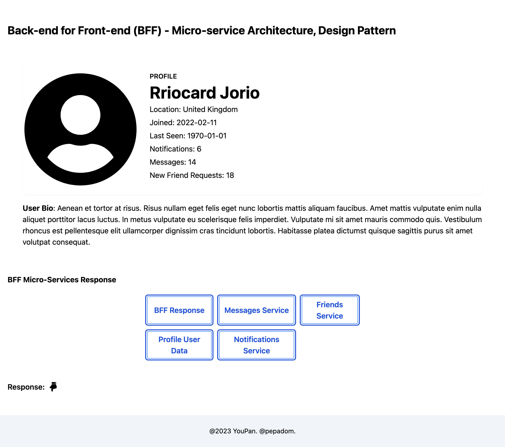

## Back-end for Front-end (BFF) Design Pattern with Next.js

[PepaDom](mailto:dev@youpan.com)

This is a simple demo [Next.js](https://nextjs.org/) project bootstrapped with [`create-next-app`](https://github.com/vercel/next.js/tree/canary/packages/create-next-app).

> The BFF (Backend For Frontend) approach is a design pattern that involves creating a separate backend service specifically tailored to the needs of a frontend application. This approach allows for better decoupling and flexibility in managing the frontend-backend interaction.

### [Click here to see the Live Demo](https://react-bff.vercel.app/)

## Screenshots



## Libraries / Tools Used

- Next.js with TypeScript
- Tailwindcss
- React-icons
- Axios

### Setup

To install the dependencies run:

```bash
npm run dev or yarn dev
```

### Interaction between Front-end components and data using the BFF approach:

1. <b>Frontend Components</b>: The React components represent the (UI) of the application. They define the structure and behavior of the various views and elements displayed to the user. These components are responsible for rendering the data received from the backend and triggering actions based on user interactions.

2. <b>Backend API</b>: The BFF server acts as an intermediary between the frontend components and the backend services or APIs. It encapsulates the communication with the backend services and exposes a simplified API that aligns with the specific needs of the frontend. This allows the frontend to consume data and perform actions without directly depending on multiple backend services.

3. <b>Data Fetching</b>: Typically done with axios or browser fetch API.

4. <b>Typescript Models/Interfaces</b>: TypeScript is used to define models or interfaces that represent the data structures exchanged between the frontend and the BFF server. These models ensure type safety and help in maintaining a consistent contract between the frontend and backend.

5. <b>BFF Server:</b> The BFF server receives requests from the frontend components, processes them, and interacts with the relevant backend services or APIs (example pages/api/user.ts). It may perform operations such as authentication, data aggregation, caching, or transformation before returning the response to the frontend.

### Example how to Add static data per service

e.g. utils/data/user.json

### Short overview of adding multiple Back-end services in the BFF layer:

- This way we call only 1 API
- It's more efficient, more optimized
- Front-end can render what is needed, not the whole API data
- BFF layer is tightly coupled to the Front-end, i.e. BFF creates a new Back-end only for the service that the Front-end needs

### Example Services for User Profile

- Messages - one endpoint
- Notification - one endpoint
- Friend request
- User

### API Routes

[API routes](https://nextjs.org/docs/api-routes/introduction) can be accessed on [http://localhost:3000/api/bff](http://localhost:3000/api/bff). This endpoint can be edited in `pages/api/bff.ts`.

The `pages/api` directory is mapped to `/api/*`. Files in this directory are treated as [API routes](https://nextjs.org/docs/api-routes/introduction) instead of React pages.

### Future Work:

- add TanStack Query (FKA React Query) for Next to test, can be tested: http://localhost:3000/posts
- unit tests

#### Deploy on Vercel
